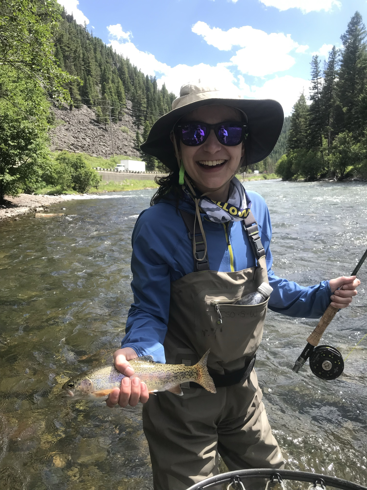

I am currently a Masters Student at Columbia's Mailman School of Public Health pursuing a degree in Biostatistics.

(For my full resume please refer to [LinkedIn](https://www.linkedin.com/in/julia-gray-ny/))

### Education
* Columbia University Mailman School of Public Health, New York, NY
    * Masters of Science, Biostatistics  | Expected Graduation Summer 2027
* Northwestern University, Evanston, IL
    * Bachelors of Arts, Major in Cognitive Science & Minor in Global Health | 2012-2016
* Sciences Po, Paris, France
    * Study Abroad, Public Health Systems in Europe  | Fall 2014

### Experience

* Sumitomo Pharma America, New York, NY
    * Director, Clinical Intelligence | July 2023 - June 2024
* Sumitovant Biopharma, New York, NY
    * Director, Drug Development Intelligence | April 2021 - July 2023
    * Associate Director, DrugOme Design & Analytics | December 2019 - March 2021
* Roivant Sciences, New York, NY
    * Engineer, Computational Research | June 2017 - December 2019
    

### Other

In my free time I love hiking and fishing.

